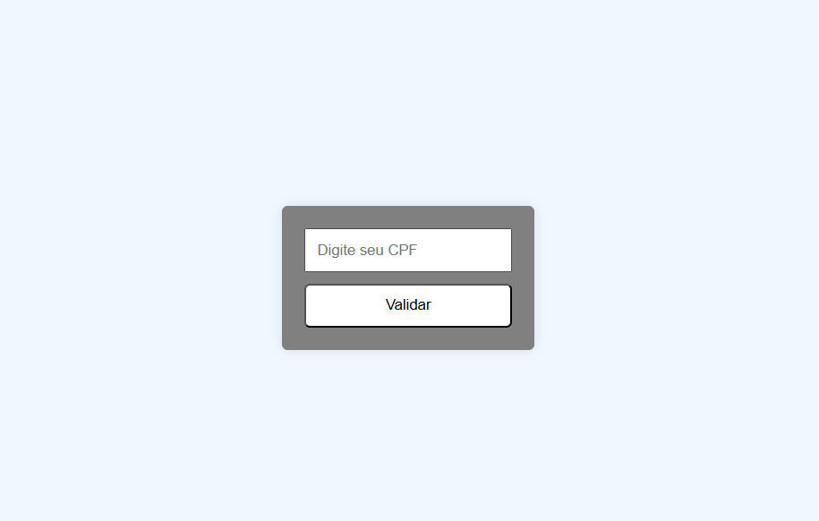
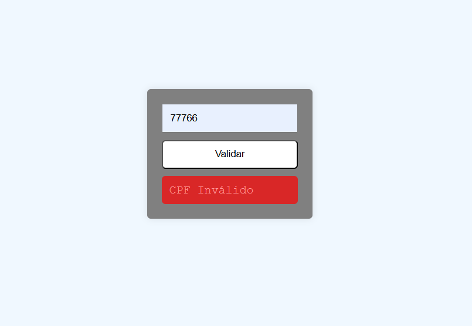
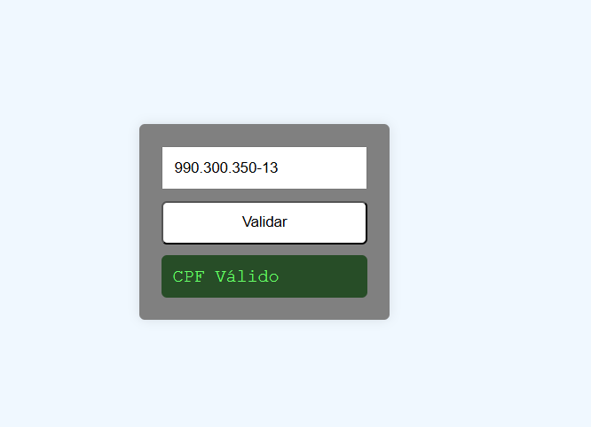

# 📄 Projeto: Validador de CPF

Este projeto tem como objetivo desenvolver uma **aplicação web simples e funcional** para **validar números de CPF (Cadastro de Pessoa Física)** conforme as regras oficiais da Receita Federal, utilizando **HTML5**, **CSS3** e **JavaScript puro (ES6)**.

O projeto é ideal para praticar **manipulação de formulários**, **validação de entrada do usuário** e **lógica algorítmica**, além de aplicar boas práticas de layout com CSS.

---

## 🛠️ Tecnologias Utilizadas

### 🖥️ Frontend


---

## 🚀 Funcionalidades

- Validação de CPF conforme o algoritmo oficial (verificadores)
- Exibição de mensagens de sucesso ou erro
- Prevenção de caracteres inválidos (somente números)
- Interface simples

---

## 📂 Estrutura do Projeto

```
validador-cpf/
├── index.html # Página principal com o formulário
├── style.css # Estilo visual da aplicação
├── script.js # Validação do CPF
├── assets/
│     └──  img # Captura de tela do projeto
└── README.md # Documentação do projeto
```

---

## 📸 Imagem de Prévia





---

## 🎨 Paleta de Cores

| Elemento                | Cor             | HEX       | 
|-------------------------|------------------|-----------|
| Fundo da Página         | aliceblue     | `rgb(240, 248, 255)` |
| Texto Principal         | Preto     | `black` |
| Mensagem de Sucesso     | Verde            | ` rgb(106, 253, 106)` |
| Mensagem de Erro        | Vermelho         | `rgba(255, 0, 0, 0.699)` |

---

## 📸 Prévia do Projeto

(https://natieledpaula.github.io/Validar-CPF/)

---

## 📖 Como funciona a validação?

A lógica implementada segue o algoritmo oficial da Receita Federal:

1. Elimina CPFs com dígitos repetidos (ex: 111.111.111-11)
2. Calcula o **primeiro dígito verificador** com base nos 9 primeiros dígitos
3. Calcula o **segundo dígito verificador**
4. Compara os dígitos calculados com os fornecidos

Caso ambas verificações estejam corretas, o CPF é considerado válido.

---

## 🧠 Aprendizados

- Validação algorítmica em JavaScript
- Manipulação de strings e arrays
- Eventos de formulário (input, submit)
- Estilização com foco em acessibilidade e UX
- Boas práticas com código limpo e reutilizável

---

## 📜 Licença

Este projeto está licenciado sob a **Licença MIT**.  
Sinta-se à vontade para usar, modificar e distribuir com os devidos créditos.
